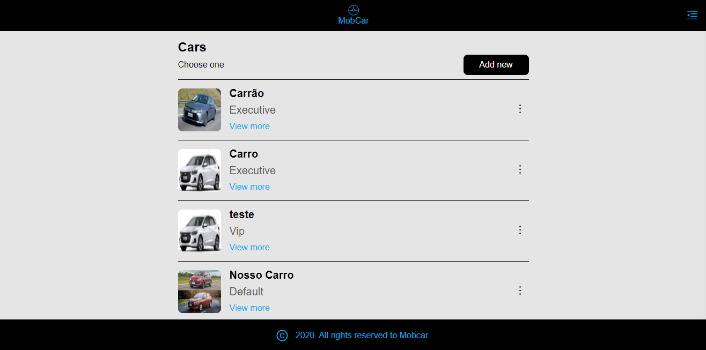
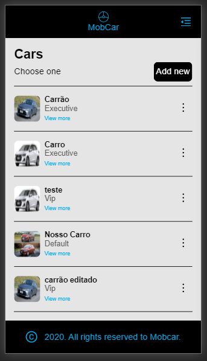
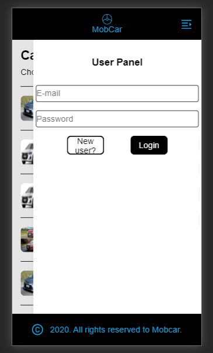
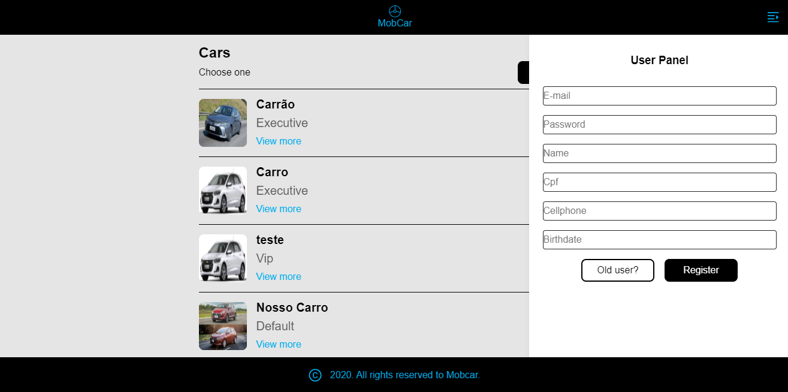
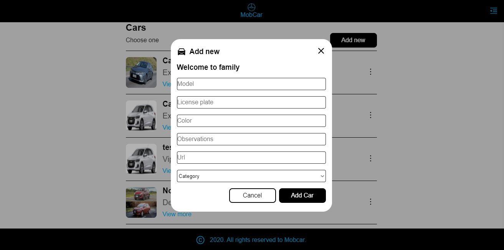
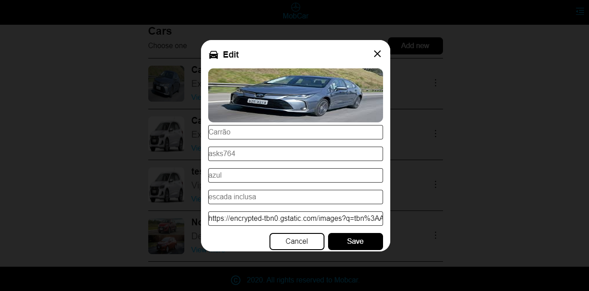
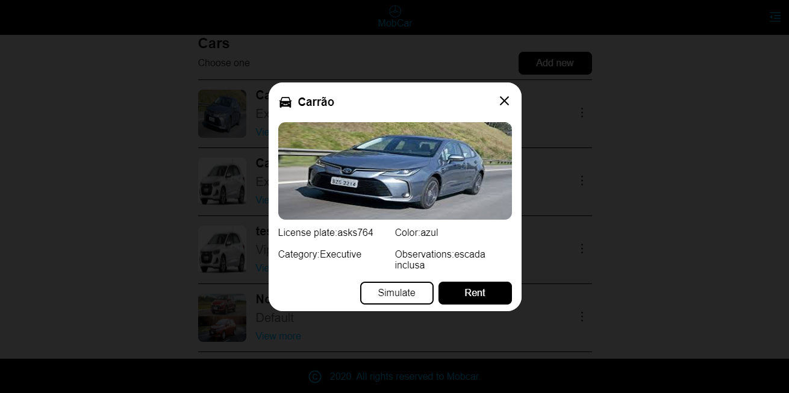

<h1 align="center" >
  
 MobCar 
</h1>

<p align="center">MobCar foi desenvolvido como teste de admissão da empresa Moblize</p>


<p align="center">
 <a href="#-sobre">Sobre</a> •
 <a href="#-layout">Layout</a> • 
 <a href="#-executando-o-MobCar">Como executar</a> • 
 <a href="#-tecnologias">Tecnologias</a> 

</p>

---

## 💡 Sobre

Esta aplicação gerencia um negócio de aluguel de carros, automatizando todos os processos desde cadastros de carros até calculo de valores e aluguéis.

Algumas alterações foram feitas no projeto original como por exemplo a adição do campo de senha ao cadastrar um usuário para implementar a função de cadastro na aplicação, todas as mudanças foram feitas com o intuito de tornar possível a integração do front-end com o back-end fazendo assim uma aplicação completa (FullStack)

Desenvolvido utilizando a metodologia mobile first

Teste realizado em aproximadamente 4 dias

---

## 🎨 Layout


### Web

<p align="center">


                                Dashboard
  


                           Dashboard Mobile                 
  


                        Sidebar com painel de login
  

                          Sidebar com painel de registro
  

                        Funcionalidade de adição de carros
  

                        Funcionalidade de edição de carros
  

                          Vizualização detalhada de carros
  
  
</p>
<br>


## 👌 Funcionalidades


* Dashboard visual que lista todos os carros disponíveis
* Registro de usuários
* Login de usuários
* Cadastro de carros para aluguel
* Detalhe de carros cadastro
* Edição de carros cadastrados
* Calculo de preço de aluguel
* Aluguel de carros
  
<br>


---

## 👁‍🗨 Insomnia


[](https://insomnia.rest/run/?label=MobCar&uri=https://raw.githubusercontent.com/JohnLDev/MobCar/master/back-end/Insomnia_2020-11-16.json?token=AQVFH2YHBLBM6N3AAKYUZAC7PTKWK)

OBS:Para testes por padrão é criada uma conta admin com as credenciais  email: __admin@admin.com__ e password: __admin__


OBS2: Dentra da pasta back-end existe um readme com a exemplificação de todas as rotas
---
## 💻 Executando o MobCar

<br>

### Pré-requisitos

É necessário ter instalado na sua máquina para execução desse projeto:
- NodeJS
- Gerenciador de pacotes (Npm ou Yarn) 
- Banco de dados postgreSQL(Local ou através de docker)
  - caso opte por instalar o docker este é um tutorial de instalação      
   [](https://www.notion.so/Instala-o-do-Docker-8230846ae2c547b2988f2aca91fc1edf)
  - Com o docker instalado será necessário criar um container postgreSQL através do comando 
  ```bash 

    $ docker run --name nome -e POSTGRES_PASSWORD=senha -p 5432:5432  -d postgres

    ```
    - O retorno será o id do container criado e isso indica que tudo está funcionando 
    - Agora será preciso acessar o banco de dados através de um software adequado (Beekeeper studio,DBeaver) e criar um banco de dados que sera usado no .env
    - Talvez seja necessário ativar a extensão uuid-ossp ao branco de dados
  

### ♊ Clonando o Repositório

```bash

$ git clone https://github.com/johnldev/MobCar

# entre na pasta do projeto

$ cd MobCar

```
### 💻 Rodando o MobCar web

Entre na pasta

```bash

$ cd front-end

```
Instale as dependências

```bash

$ yarn

# ou, caso use npm

$ npm install

```

Rode a aplicação

```bash

$ yarn start

# ou, caso use npm

$ npm run start

```


### 🌐 Rodando o Servidor

Entre na pasta

```bash

$ cd back-end

```
Instale as dependências

```bash

$ yarn

# ou, caso use npm

$ npm install

```

- Nesse momento crie um arquivo .env na raiz do projeto e o preencha com os dados do seu banco de dados utilizando o arquivo .env-example como exemplo

Modele o banco de dados

```bash

$ yarn typeorm migration:run

# ou, caso use npm

$ npm run typeorm migration:run

```
- obs : talvez sejá necessário instalar a extensão uuid-ossp no banco de dados

Rode o servidor

```bash

$ yarn dev:server

# ou, caso use npm

$ npm run dev:server

```


### 📱 Rodando o MobCar mobile 

<br>
<h4 align="center"> 
	🚧  Em Breve...  🚧

  🚧  Porém, enquanto isso... o MobCar é todo Responsivo!!  🚧
</h4>
<br>

---


## 🛠️ Tecnologias

As ferramentas usadas no desenvolvimento do projeto.

#### Backend:
- Typescript
- NodeJS
- Express
- PostgreSQL
- TypeORM
- JsonWebToken
- Bcryptjs
- Tsyringe
- Uuidv4
- Testes Automatizados


#### Web
- Typescript
- ReactJS ⚛️
- React Router Dom
- React Icons
- Axios
- Styled Components
- Yup

#### Mobile:

<br>
<h4 align="center"> 
	🚧  Em Breve...  🚧
</h4>
<br>

---
